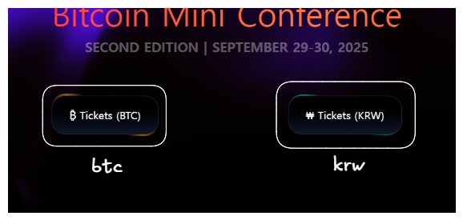
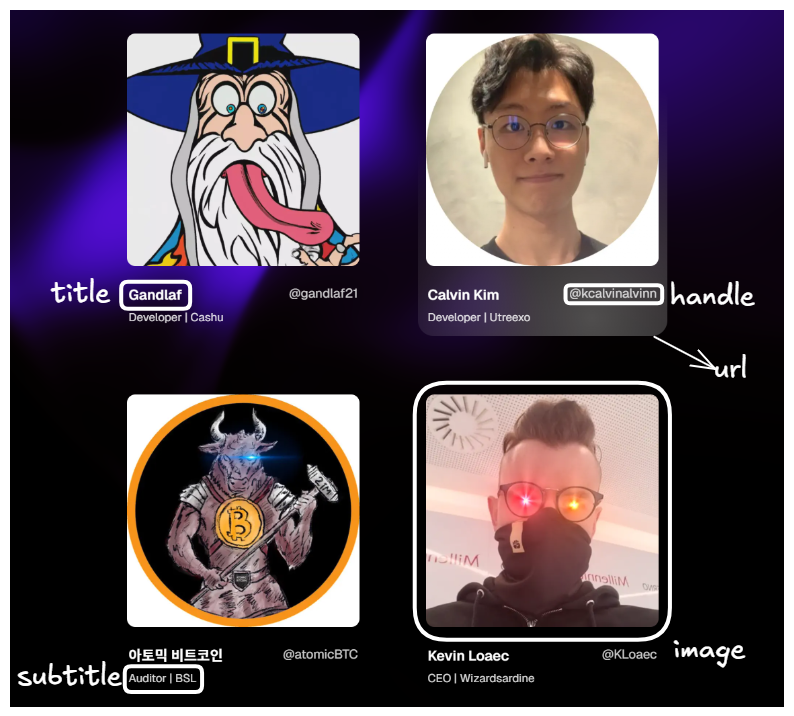
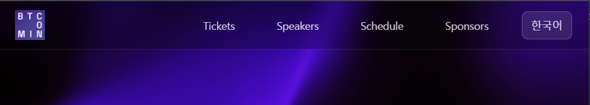

# Bitcoin Mini Conf Web

## Quick Start

```bash
git clone https://github.com/JayChae/mini-conf.git
cd mini-conf
pnpm install
pnpm dev
```

## Quick Edit

This project can be easily modified through the [`app/messages`](./app/messages/) folder.

### Messages Folder Structure

```bash
app/messages/
├── en.json        # titles & subtitles (en)
├── ko.json        # titles & subtitles (ko)
├── nav.ts         # Navigation menu (en & ko)
├── schedules.ts   # Schedule information (en & ko)
├── speakers.ts    # Speaker information (en & ko)
├── sponsor.ts     # Sponsor information (en & ko)
└── tickets.ts     # Ticket purchase links (en & ko)
```

## [tickets.ts](./app/messages/tickets.ts)

### Edit the ticket purchase button text and link



#### Simply want to modify the URL, edit it in urlList.

```ts
const urlList = {
  //Bitcoin purchase link
  btc: "https://store.btcmap.kr/meetup/Bitcoin_Mini_Conference/11/",
  //Korean won purchase link.
  krw: "https://smartstore.naver.com/promenadecastle/products/12055415750",
};
```

#### Want to modify the text, edit it in enTickets or koTickets.

```ts
export type TicketButton = {
  name: string; //button text
  url: string; //button Link
  color: string; //border animation color
};

const enTickets: TicketButton[] = [
  {
    name: "₿ Tickets (BTC) ",
    url: urlList.btc,
    color: "orange",
  },
  {
    name: "₩ Tickets (KRW) ",
    url: urlList.krw,
    color: "cyan",
  },
] as const;
```

## [speakers.ts](./app/messages/speakers.ts)

### Edit the Speakers

You need to put the image in the [public/avatars](./public/avatars/). The path will be `/avatars/image.png`.

```bash
public/avatars/
├── atomic.webp
└── calvin.webp
```



```ts
export type Speaker = {
  image: string; //Avatar
  title: string; // Name
  subtitle: string; // Description
  handle: string; //SNS Handle
  url: string; // SNS Link
};

//english version
const enItems: Speaker[] = [
  {
    image: "/avatars/atomic.webp",
    title: "Atomic Bitcoin",
    subtitle: "Auditor | BSL",
    handle: "@atomicBTC",
    url: "https://x.com/atomicbtc",
  },

  ....
//korean version
const koItems: Speaker[] = [
    {
    image: "/avatars/atomic.webp",
    title: "아토믹 비트코인",
  ...
```

## [schedules.ts](./app/messages/schedules.ts)

### Edit the Schedules


You need to put the image in the [public/schedules](./public/schedules/). The path will be `/schedules/image.png`.

```bash
public/schedules/
├── mainDay.webp
└── uniDay.webp
```

```ts
export type Schedule = {
  title: string;
  date: string;
  description: string; //simple description
  content: string; // detail description
  image?: string; //image of schedule
  alt?: string; // alt for image err
};

const koSchedules: Schedule[] = [
  {
    title: "첫째 날",
    date: "2025.9.29",
    description: "",
    content:
      "비트코인의 이해도가 높고 인사이트가 있는 사람들...",
    image: "/schedules/mainDay.webp",
    alt: "mainDay",
    ...

const enSchedules: Schedule[] = [
  {
    title: "First Day",
    date: "September 29, 2025",
    description: "Curated talks to deliver maximum signal-to-noise ratio.",
    content:
      "A single stage with insightful talks prepared by industry leading experts....",
    image: "/schedules/mainDay.webp",
...
```

### Edit the Schedules

## [sponsor.ts](./app/messages/sponsor.ts)

### Edit the Sponsor


You need to put the image in the [public/sponsors](./public/sponsors/). The path will be `/sponsors/image.png`.

```bash
public/sponsors/
├── nonceLab.webp
└── hrf.webp
```

```ts
export type Sponsor = {
  name: string;
  url: string;
  image: string;
};

const sponsors: Sponsor[] = [
  {
    name: "NonceLab",
    url: "https://noncelab.com",
    image: "/sponsors/nonceLab.webp",
  },
  {
    name: "HRF",
    url: "https://hrf.org",
    image: "/sponsors/hrf.jpg",
  },
] as const;
```

## [en.json](./app/messages/en.json) & [ko.json](./app/messages/ko.json)

### titles of each section

If you want to change Korean, modify ko.json, and if you want to change English, modify en.json.

```json
{
  "Hero": {
    "title": "Bitcoin Mini Conference",
    "subtitle": "SECOND EDITION | SEPTEMBER 29-30, 2025"
  },
  "Speakers": {
    "title": "Speakers"
  },
  "Schedule": {
    "title": "Schedule"
  },
  "Sponsor": {
    "title": "Sponsors"
  }
}
```

#### hero section title


#### section title


## [nav.ts](./app/messages/nav.ts)



```ts
export type NavItem = { 
  label: string; //text
  href: string  // href
};
...
//english nav
const enItems: NavItem[] = [
  { label: "Tickets", href: hrefList.home },
...
//korean nav
const koItems: NavItem[] = [
  { label: "티켓", href: hrefList.home },
...
```
